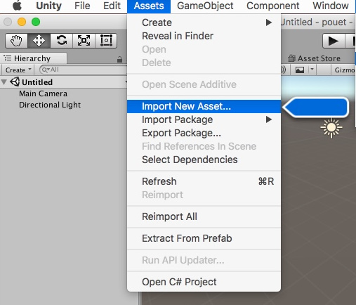

# Unity and Nethereum

Nethereum now integrates within Unity, here's how to get started quickly:

1 - Download Unity [>>> HERE <<<](https://unity3d.com/get-unity/download)

2 - Download Nethereum's Unity DLL [>>> THERE <<<](https://github.com/Nethereum/Nethereum/releases/download/2.0.0/Nethereum.Unity.zip)

3 - Import the DLLs you just downloaded in Unity as assets:

